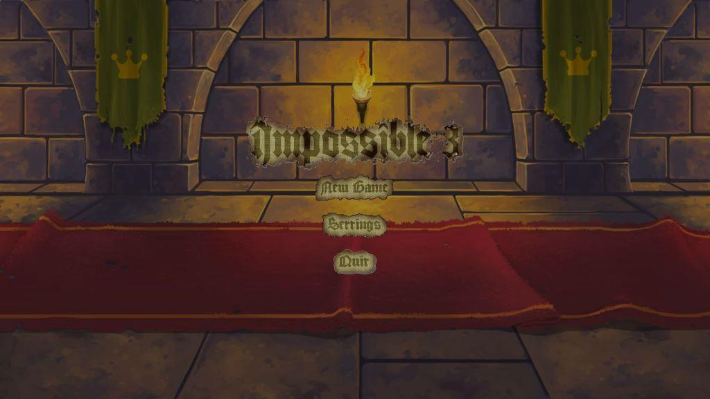
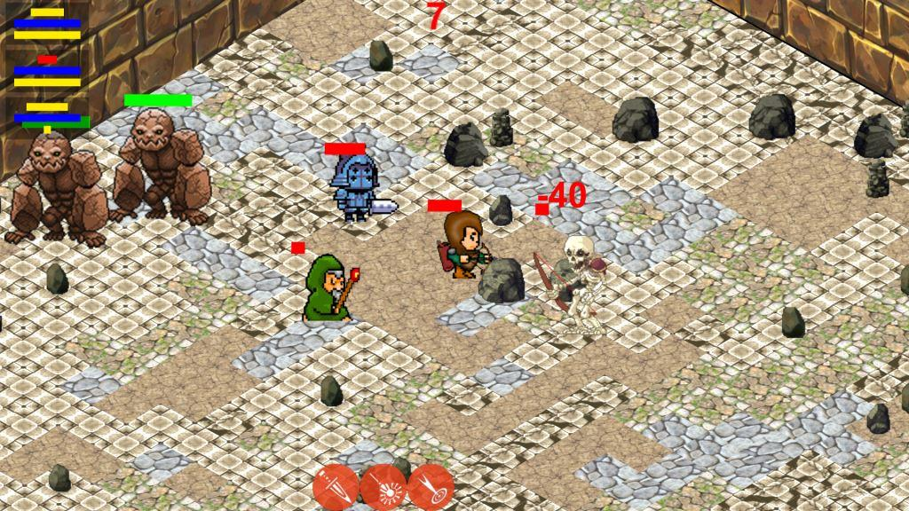
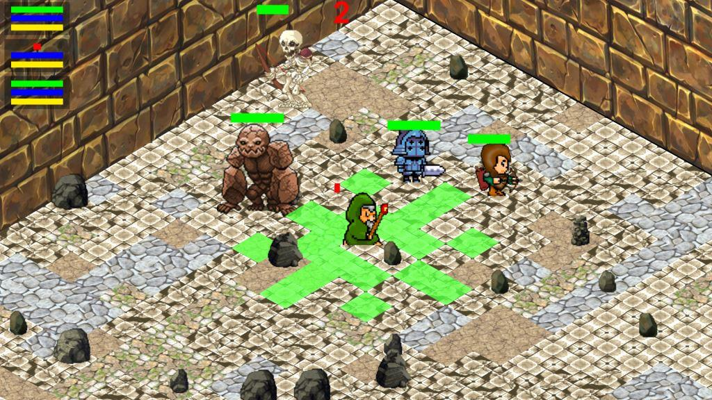
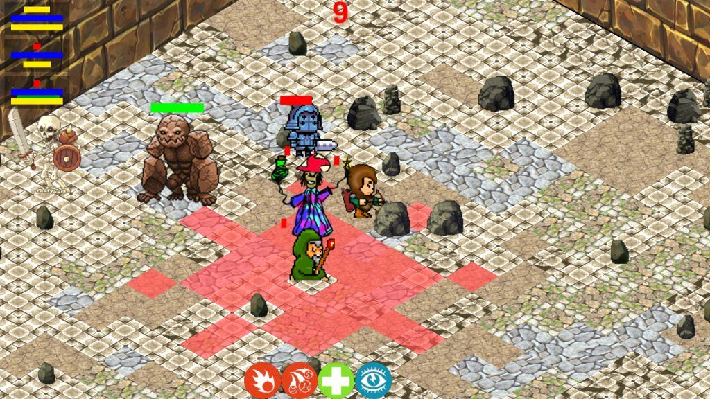
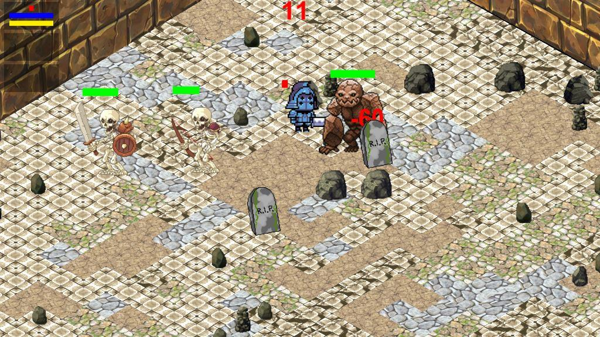

# Impossible3

##### Developed by: Nick Soffa, Flanders Lorton, Justin Sanny, Erik Tsai,  Ronald Uy, and James Yen.

Inpossible 3 is a real time strategy game developed in Unity 3D. The player must control 3 different units simultaneously, a mage, an archer, and a knight. These 3 characters face the impossible task of fighting endless waves of oncoming enemies. But they can use their skills to their advantage and level up new abilities to strategically face the evil horde. 

### Instructions

#### *KEYBOARD & MOUSE CONTROLS*

##### CAMERA CONTROLS :

○ W - Moves Camera Up

○ A - Moves Camera Left

○ S - Moves Camera Down

○ D - Moves Camera Left

##### MOVEMENT CONTROLS :

○ Right Mouse Click - Movement

■ User right clicks on character & right clicks again to 
corresponding square

##### ATTACK CONTROLS

○ Left Mouse Click - Attack

■ User left clicks on character & left clicks again on corresponding square or enemy if
in range.

○ Number Row 1-6 - Use ability

■ User left clicks on character & presses any key from 1-6 to select an
ability. Left click on enemy to use ability.

### CHAMPIONS

○ Player has control over three different characters, each with unique abilities:

○ These abilities automatically unlock in order as your party gets more enemy kills.

##### Warrior: A close range, hard hitter.
- Sentinel: Protect yourself & fight back! This ability allows you to negate the next enemy attack & counter with a very high damage dealing attack.
- Flail: Don’t get ganged up! This ability has a medium AoE effect. While this ability does low damage, it allows you to surrounding damage to enemies nearby.
- Frenzy : A short rang e AoE (Area of Effect) attack. This ability does high damage, but can also cause damage to the player.
- Rally: Stand together! This ability buffs your whole team for a short amount of time! It decreases all cooldowns for your party
- Warpath : Unleash your fury! This ability allows you to charge directly into the enemy and attack, while also reducing the damage you take & boosting the damage you inflict.
- Shield Bash: Bash enemies with your shield. This ability is very short range. It does medium damage while also knocking back the enemy.
##### Mage: Arcane Master from Years Past

- FireBall: Light them up. This ability targets an enemy at
medium range. It also does high damage.
- Firestorm : Set them ablaze. This long range ability allows you to target enemies in the surrounding area. It does medium damage.
- Heal: Refresh your troops! This ability heals a single unit in your party!
- Blinding Light: Blind them all! This medium range ability lowers the accuracy of the surrounding enemies by blinding them with light.
- Decay : Let them rot. This is a long range ability that targets one enemy from far away and causes the enemy to take continuous damage over time. It also slows down the targeted enemy’s cooldown regeneration.
- Divine Shield: Protect them all. This ability highly reduces the amount of damage the players will take for a certain amount of time.
##### Ranger: A long range attacker
- Backstab : Payback hurts. This ability is very short range, but deals a single high damage strike!
- Black Bomb Arrow : BOOM. This medium range attack does damage to a targeted enemy and any other enemies around the target.
- Long Shot: Aim carefully...This ability targets an enemy from long range while doing very high damage.
- Shadow Step: Like a ghost… This ability decreases the chances of the archer being hit.
- Snare : One last chance. This ability targets an enemy at medium range & immobilizes them for a short amount of time.
- Triple Shot : They won’t know what hit them. This long range ability allows you to target up to three enemies at once while doing medium damage.

### Good luck! How long can you survive?

#### Made as a Senior Project

CMSI 401 at Loyola Marymount University. Taught by Prof. Johnson.
